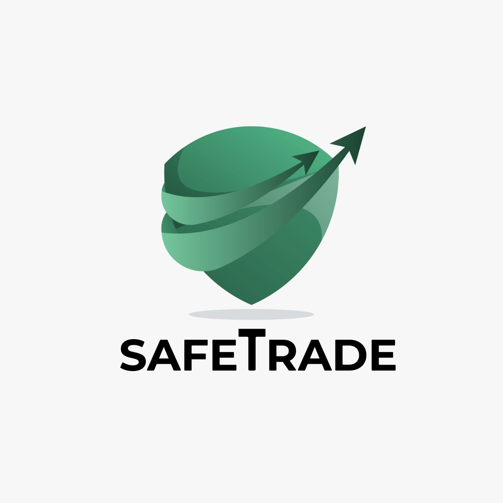

 
<h3 align="center">

</h3>
 

 <a href="#-Safe-Trade">Sobre</a> •
 <a href="#-Integrantes">Integrantes</a> • 
 <a href="#-Tecnologias">Tecnologias</a> • 
 <a href="#-Instruções-de-utilização">Instruções de Utilização</a> •
 <a href="#-Referências">Referências</a>  

# 📝 Safe Trade

A plataforma SafeTrade foi pensada como uma aplicação web que permite aos usuários trocar skins de jogos de forma segura e eficiente. Nossa missão é facilitar a troca de skins entre jogadores, oferecendo um ambiente confiável e transparente.

## Integrantes

- Sérgio Parreiras
- Roberta Micaela
- Lucas Lafetá 

## 💻 Introdução

Bem-vindo à nossa aplicação! Este guia rápido irá ajudá-lo a navegar pelas principais funcionalidades e aproveitar ao máximo sua experiência.

### Acesso à Conta

- **Login/Cadastro**: Ao abrir a aplicação, você pode:

  - **Logar**: Se já possui uma conta, insira suas credenciais.

  - **Criar uma Conta**: Caso seja novo usuário, siga as instruções para criar uma conta.

### Funcionalidades Principais

#### Anunciar

- **Anúncio**: Após o login, clique na aba "Anúncio" para criar um novo anúncio.

  - Preencha os detalhes necessários do seu item ou serviço.

  - Publique o anúncio para que outros usuários possam vê-lo.

#### Realizar Trocas

- **Trocas**: Para iniciar uma troca com outro usuário:

  - Clique na aba "Trocas".

  - Utilize o chat integrado para discutir os termos da troca e finalizar a negociação.

#### Tornar-se Parceiro

- **Parceiros**: Para estabelecer parcerias:

  - Navegue até a aba "Parceiros".

  - Preencha uma proposta de parceria detalhando o que oferece e o que procura.

  - Espere que o SafeTrade entre em contato para negociar a parceria.

## Passo a Passo de Instalação

### Passo 01: Clone o Repositório

git clone https://github.com/ICEI-PUC-Minas-PPLES-TI/plf-es-2024-1-ti2-1381100-safe-trade.git

### Passo 02: Instalar Dependências

#### Backend

1. Acesse a pasta do backend:
cd back/demo

2. Instale as dependências do Maven:
   
mvn clean install

#### Frontend

1. Acesse a pasta do frontend:

cd front

2. Instale as dependências do npm:

npm install

### Passo 03: Configurar Banco de Dados

Certifique-se de que você tem o PostgreSQL instalado e rodando em sua máquina. Crie um banco de dados chamado `safetrade` e atualize as configurações em `application.properties` na pasta `src/main/resources` do backend

properties
spring.datasource.url=jdbc:postgresql://localhost:5432/safetrade
spring.datasource.username=seu-usuario
spring.datasource.password=sua-senha
spring.jpa.hibernate.ddl-auto=update
spring.jpa.show-sql=true

### Passo 04: Iniciar Backend
- Acesse a pasta clonada no Passo 01 pelo CMD:
cd back/demo

- Inicie a aplicação backend:
  
mvn spring-boot:run

A aplicação backend estará rodando na porta [http://localhost:8081](http://localhost:8081).

### Passo 05: Iniciar Frontend
markdown
Copiar código
- Acesse a pasta clonada no Passo 01 pelo CMD:
cd front

- Inicie a aplicação frontend:

A aplicação frontend estará rodando em [http://localhost:5173](http://localhost:5173).

## Usuário de Teste

- **Login**: admin@email.com
- **Senha**: 123456

## Histórico de versões

- 1.0.0
  - Consolidação da versão final do código.

  ## Referências

- [Adrenaline](https://www.adrenaline.com.br/games/cuidado-novo-golpe-oferece-skin-gratuita-e-rouba-contas-na-steam/)
- [Forbes](https://forbes.com.br/forbes-tech/2022/03/por-que-os-gamers-valorizam-tanto-as-roupas-e-acessorios-virtuais/)
- [CNN Brasil](https://www.cnnbrasil.com.br/tecnologia/publico-gamer-cresce-e-3-em-cada-4-brasileiros-consomem-jogos-eletronicos/)
- [Sebrae RS](https://digital.sebraers.com.br/blog/mercado/tendencias-para-a-industria-de-games-em-2024/#:~:text=A%20expectativa%20para%20os%20pr%C3%B3ximos,242%2C7%20bilh%C3%B5es%20no%20setor.)
- [Statista](https://www.statista.com/study/39310/video-games/?locale=en)
