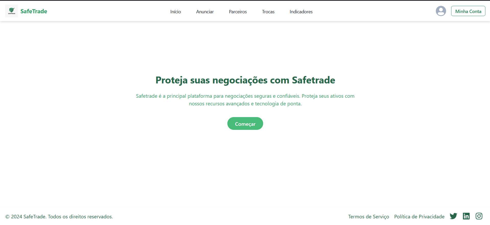
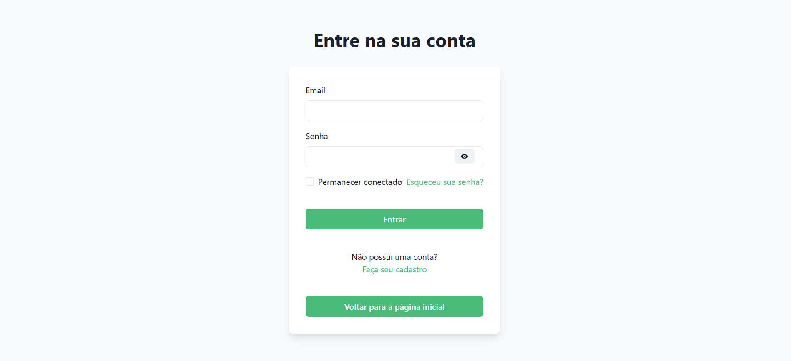
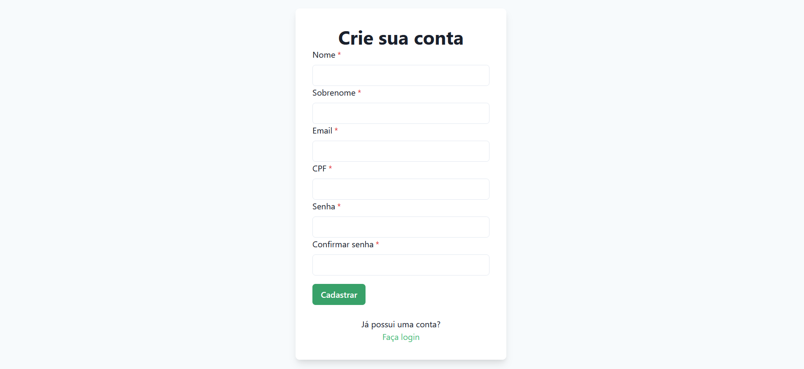
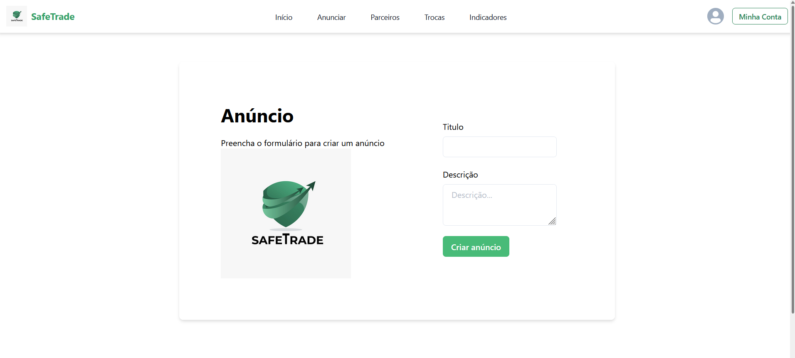
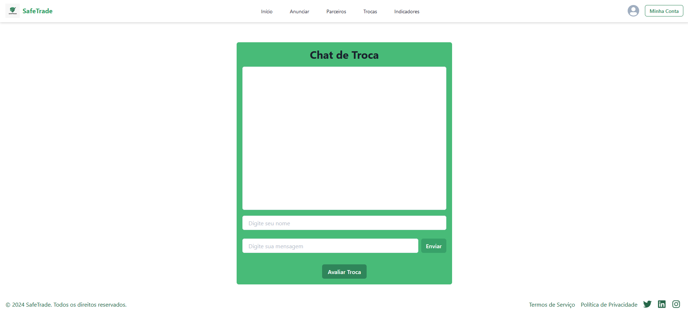

# Safe Trade

**Miguel Pedrosa | miguelpedrosacarmononato@gmail.com**

**Sérgio Parreiras | sergioparreiras09@gmail.com**

**Roberta Micaela | roberttamicaella@gmail.com**

**Lucas Lafetá | lucaslmchaves@gmail.com**

**Matheus Cançado | mirandacancado@gmail.com**

**Yan Cota | yanmariz10@gmail.com**

---
# Professores:
* Cristiano Macedo Neto 
* Danilo Boechat Seufitelli
---

_Curso de Engenharia de Software_

_Instituto de Informática e Ciências Exatas – Pontifícia Universidade Católica de Minas Gerais (PUC MINAS), Belo Horizonte – MG – Brasil_

---

O projeto "safeTrade" surge como uma resposta inovadora às demandas em constante evolução no mundo dos jogos eletrônicos. Ele cria uma rede complexa que une jogadores, reguladores e entusiastas da indústria para abordar as necessidades emergentes. Em meio ao crescimento exponencial da participação dos jogadores e da importância dos itens dentro dos jogos, o "safeTrade" oferece uma plataforma confiável para a troca desses itens, através da troca de contas, mitigando o risco dos usuários caírem em golpes. A iniciativa abrange desde melhorias na experiência do jogador até a implementação de sistemas de autenticação. A segurança é um foco central, visando combater fraudes e golpes nos mercados de itens de jogos.

---

## 1. Introdução

A plataforma SafeTrade foi pensada como uma aplicação web que permite aos usuários trocar contas de Jogos de forma segura e eficiente para a obtenção das skins. Nossa missão é facilitar a troca de contas entre jogadores, oferecendo um ambiente confiável e transparente.

### 1.1 Contextualização

O crescimento dos jogos online é evidente, a indústria está expandindo-se constantemente e atraindo um número cada vez maior de jogadores em diversas plataformas. De acordo com as projeções da Statista, o mercado global de games deve crescer, em média, 12,1% ao ano até 2027. (Video Games: market data & analysis. STATISTA. Julho, 2023). As skins, que são itens cosméticos que permitem aos jogadores personalizar seus avatares dentro dos jogos, desempenham um papel fundamental nesse cenário.
 
Os itens que são vendidos dentro dos jogos se tornaram extremamente populares devido à sua capacidade de conferir exclusividade e estilo aos personagens dos jogadores, criando um mercado lucrativo que opera em paralelo ao próprio universo dos jogos. Esse mercado de skins oferece uma ampla gama de opções e possibilidades de personalização, o que tem contribuído significativamente para a expansão e diversificação dos jogos online.

Diante deste cenário, a troca e venda de skins entre jogadores se tornou uma prática comum e vital na comunidade de jogos online. Além de permitir que os jogadores personalizem seus avatares de acordo com suas preferências, essa atividade também cria uma economia virtual robusta e dinâmica. Os jogadores podem negociar entre si para obter skins raras ou desejadas, enquanto alguns optam por vender suas skins para obter lucro ou adquirir novos itens. Essa interação entre os jogadores não só fortalece a comunidade, mas também adiciona uma camada extra de diversão e estratégia aos jogos. 

Uma das formas de se realizar a troca de Skins é por meio da permutação das contas de jogo entre dois usuários, meio o qual o projeto Safe Trade se concentra e busca desenvolver.

### 1.2 Problema

  
O mercado de skins gera uma grande movimentação financeira no mundo Gamer. “Estima-se que esse mercado, de venda de ativos virtuais dentro de jogos, movimente mais de US$ 50 bilhões ao ano.’’ (GUSTAVO PACETE, LUIZ. “Por que os gamers valorizam tanto as roupas e acessórios virtuais?”. FORBES. 10 de março de 2022). Fato que ocorre devido a empolgação dos jogadores na compra desses itens, que podem ser definidos como acessórios que descrevem a aparência dos personagens. O preço médio de uma skin pode variar muito, dependendo do jogo, da raridade e de outros fatores. Em jogos populares como Fortnite, League of Legends e Valorant, as skins podem variar de alguns dólares a centenas de dólares, dependendo da demanda. Algumas skins extremamente raras podem até mesmo alcançar milhares de dólares em mercados de terceiros.
 
Essa crescente procura e valorização das skins tornou-se um atrativo para os golpistas, pois eles viram a possibilidade de lucrar enganando usuários com falsas vendas e com o roubo de dados da conta. Os usuários têm dificuldade em encontrar plataformas seguras para realizar as transações devido a essa situação.

 O objetivo do projeto é solucionar a falta de segurança e confiabilidade nas trocas de skins, evitando prejuízos financeiros ao permitir apenas a troca de contas de jogos, a fim de se obter as Skins, sem envolver movimentação de dinheiro. 

### 1.3 Objetivo geral

O objetivo geral do projeto é desenvolver um software que permita aos jogadores de jogos online trocar as contas entre si de forma segura, rápida e fácil, utilizando uma plataforma intuitiva e confiável, que serve como mediador.

#### 1.3.1 Objetivos específicos

--> Fornecer segurança: Garantir aos usuários segurança em suas transações. Dessa forma, os usuários podem realizar suas trocas com tranquilidade, sem o risco de serem vítimas de fraudes ou roubo de dados.

--> Atrair a comunidade de skins: Cativar os amantes de skins, oferecendo uma plataforma que vá além da simples troca de itens, além de criar uma comunidade vibrante e engajada, com espaços para compartilhar experiências, dicas e até mesmo criar conteúdo relacionado às skins. Isso não só torna a plataforma mais atraente para os usuários, mas também fortalece os laços entre os membros da comunidade.

--> Facilitar a economia virtual:O objetivo é tornar a movimentação de itens virtuais, como skins, mais simples e prática, sem a necessidade de transações financeiras. Para isso, vamos oferecer uma plataforma intuitiva e fácil de usar, onde os usuários possam encontrar, negociar e trocar as contas de forma direta e segura. Ao simplificar o processo de troca, pretendemos promover uma economia virtual mais dinâmica e acessível para os amantes de skins.

### 1.4 Justificativas
  
   -->Segurança para os Jogadores: O "SafeTrade" é importante porque protege os jogadores de fraudes e golpes ao realizar as trocas de contas. Em um estudo de caso recente, um jogador decide trocar sua conta, que possui uma skin valiosa em um mercado online não seguro e acaba sendo vítima de um golpe, perdendo sua skin. Com o "SafeTrade", ele teria feito a troca com segurança, evitando a fraude e protegendo seu item.
 
  -->Valorização de Contas: O "SafeTrade" irá garantir que contas que possuem itens valiosos dos jogadores sejam trocados de forma justa. Por exemplo, um jogador possui uma skin rara e deseja trocá-la por outra de valor similar. Sem o "SafeTrade", ele corre o risco de ser enganado por outro jogador que oferece uma conta com skins de menor valor em troca. Com o sistema, a troca é feita de forma justa e segura para ambas as partes.
 
  -->Melhor Experiência: Outro benefício  do "SafeTrade", é que os jogadores terão uma experiência mais agradável ao trocar conta com os itens sem se preocupar com problemas. Muitos jogadores expressam preocupação com a possibilidade de serem enganados durante as negociações, o que pode afetar sua experiência de jogo. Com a implementação do "SafeTrade", os jogadores podem realizar suas trocas com confiança, sem o medo de problemas relacionados à segurança, resultando em uma experiência mais agradável e satisfatória.
 
  -->Regras Claras: O projeto ajuda a estabelecer regras claras para as trocas virtuais, evitando situações confusas e conflitos entre os jogadores. Por exemplo, em uma situação em que surgem dúvidas sobre as condições de uma troca, o sistema "SafeTrade" garante que as regras da troca sejam claras e previamente estabelecidas, reduzindo o potencial de conflitos e garantindo uma troca justa e transparente para todas as partes envolvidas
 
  -->Inovação nos Jogos: Ao tornar as trocas mais seguras, o "SafeTrade" traz novas ideias e formas melhores de fazer negociações nos jogos. Com a garantia de segurança proporcionada pelo sistema, os jogadores podem se sentir mais incentivados a explorar novas formas de negociação e interação entre si, resultando em novas ideias e práticas que beneficiam a comunidade de jogadores como um todo.

## 2. Participantes do processo

  Todo o processo de negociação e trocas que ocorre na SafeTrade é realizado entre usuários e a plataforma. E no nosso sistema, esses usuários podem assumir duas diferentes funções, nomeadas Publicante e Interessado.

1-Publicante
*	Publica seu produto na plataforma.
*	Tem a opção de criar sua própria oferta ou escolher entre propostas feitas por outros jogadores. 
*	Pode aceitar ou recusar as propostas feitas a ele.
* Informa se deseja receber um produto específico ou outras ofertas.

2-Interessado:
*	Oferece algum item em troca de outro que deseja.
*	Caso sua proposta seja aceita, finaliza a troca com sucesso e obtém o item.

3- Setor de Marketing:
* Responsável por captar novos parceiros
* Responsável por gerenciar os parceiros

## 3. Modelagem do processo de negócio

### 3.1. Análise da situação atual

 No cenário atual, a venda e troca de skins se tornaram atividades complexas e multifacetadas. Os Fóruns, grupos em redes sociais e plataformas como Discord e Reddit oferecem espaços para negociação direta entre jogadores.

Os processos de vendas são realizados em diferentes canais com suas características e atrativos. Em suma, são utilizadas nos processos as seguintes tecnologias:
  * APIs de jogos para acessar inventários e informações de preços.
  * Sistemas de pagamento seguros para transações online.
  * Mecanismos de avaliação de vendedores e compradores para garantir a confiabilidade

Atualmente, o processo de trocas pode ser realizado a partir das seguintes maneiras:

1: Troca com com amigos: Quando alguém deseja trocar um item, ela procura alguém em seu círculo social que também joga o mesmo jogo e está interessado em se desfazer de um item. Após os dois participantes entrarem em acordo, a troca é realizada.

2: Troca por comunidades: Atualmente, nas redes sociais, existem diversas comunidades em que pessoas buscam desapegar de seus itens, e procuram por esse meio para encontrar outros interessados, estes grupos oferecem uma grande variedade de skins e amplas possibilidades para realizar trocas.

### 3.2. Descrição geral da proposta

**Funcionamento:**

1. Sistema de Troca:

1. Sistema de Troca:
*Ambiente de Negociação: Utiliza um chat para que o usuário entre em contato com o publicante do anúncio, negocie e  realize a troca das contas.
* Busca e navegação: Os usuários podem realizar a busca  para encontrar anúncios com contas compatíveis para troca, considerando raridade e preferências.
* Sistema de Validação: Verifica a autenticidade das contas antes de qualquer troca para garantir a segurança e confiabilidade da plataforma.

2. Interface Intuitiva:

*  Busca avançada: Permite que jogadores encontrem facilmente os anúncios que desejam trocar.
*  Sistema de filtros: Filtra as contas por jogo, tipo e outros critérios relevantes.
*  Perfil de jogador: Exibe o histórico de trocas, reputação e anúncios de contas disponíveis para troca.

3. Segurança e Confiança:

*  Autenticação de dois fatores: Protege contas contra acessos não autorizados.
*  Sistema de reputação: Avalia a confiabilidade dos jogadores com base em seu histórico de trocas.
*  Monitoramento de atividades: Detectar atividades suspeitas e golpes na plataforma. (por meio de newsletter e suporte)

 
### 3.3. Modelagem dos Processos

#### 3.3.1. Processo 1 – Gerenciar usuário

O processo “Gerenciar Usuário” na plataforma SafeTrade envolve etapas como acessar a tela de login, verificar a existência da conta, cadastrar ou editar usuários conforme necessário. Uma oportunidade de melhoria seria otimizar a verificação da existência da conta para agilizar o processo. Além disso, poderia ser implementada uma funcionalidade de autoatendimento para que os usuários possam recuperar ou redefinir suas credenciais de forma independente e eficiente.

#### 3.3.2. Processo 2 – Gerenciar Anúncio

O processo de gerenciamento de anúncios na plataforma SafeTrade inclui o preenchimento de detalhes do anúncio, publicação, edição ou exclusão do mesmo, monitoramento de anúncios ativos. Uma melhoria significativa seria a integração de uma ferramenta analítica que fornece métricas de desempenho em tempo real, permitindo ajustes estratégicos para aumentar a visibilidade.

#### 3.3.3. Processo 3 – Marketing

O processo “Marketing” na plataforma SafeTrade envolve enviar propostas de parceria, receber respostas e, se aceitas, cadastrar novos parceiros. Uma melhoria seria a implementação de um sistema automatizado para gerenciar propostas, facilitando a comunicação e o acompanhamento do status das negociações. Isso poderia incluir alertas automáticos para seguir com parceiros que não responderam, além de análises preditivas para avaliar a probabilidade de aceitação de propostas, otimizando assim o processo de seleção e cooptação de novos parceiros.

#### 3.3.4. Processo 4 – Gerenciar Reputação

O processo “Gerenciar Reputação” na plataforma SafeTrade envolve a identificação e punição de usuários que tentam realizar scams, protegendo a comunidade de práticas fraudulentas. Uma melhoria significativa seria a implementação de um sistema automatizado de monitoramento de comportamento, que utilizaria algoritmos para detectar padrões suspeitos e alertar sobre possíveis tentativas de fraude. Além disso, a criação de um painel de controle para que os usuários possam reportar atividades suspeitas e a integração de um sistema de avaliação de reputação baseado em feedback dos usuários após cada transação, contribuiriam para um ambiente mais seguro e transparente.

#### 3.3.5. Processo 5 – Gerenciar Troca

O processo “Gerenciar Troca” na plataforma SafeTrade consiste em encontrar um anúncio de interesse, conversar diretamente com o anunciante e oferecer uma conta em troca e, dependendo da resposta, concluir a troca ou receber uma recusa. Caso a proposta seja aceita, os participantes trocam logins e senhas e avaliam a troca. Para melhorar esse processo, poderia ser implementado um sistema de avaliação automática para as skins, proporcionando aos usuários uma estimativa de valor em tempo real. Além disso, um mecanismo de negociação mais interativo e robusto poderia facilitar as trocas, tornando o processo mais eficiente e agradável para os usuários.

## 4. Projeto da solução

Esta seção detalha o desenvolvimento e a implementação de soluções estratégicas na plataforma SafeTrade. O foco é apresentar as metodologias e tecnologias utilizadas para resolver problemas identificados durante a análise dos processos de negócio. Inclui a criação de novas ferramentas, aprimoramento de sistemas existentes e integração de recursos que visam melhorar a experiência do usuário e a segurança da plataforma. 

### 4.1. Modelo de Dados

O modelo de dados abaixo apresenta as informações que serão armazenadas em cada um dos processos definidos anteriormente.

### 4.2. Tecnologias

Aqui estão as tecnologias que serão utilizadas no projeto para a solução dos problemas:

| Tecnologia ou ferramenta | Utilização                                                                              	|
| ------------------------ | ------------------------------------------------------------------------------------------- |
| Figma                	| Para a criação do styleguide do nosso projeto                                           	|
| Heflo                	| Para a realização da modelagem dos processos                                            	|
| GitHub               	| Versionamento dos arquivos em repositório remoto                                        	|
| Git                  	| Gerenciamento das versões dos arquivos                                                  	|
| WhatsApp             	| Usado para facilitar a comunicação entre os participantes do grupo                      	|
| Discord              	| Utilizado para realizar reuniões com os participantes do trabalho para organizar as tarefas |
| Visual Studio Code   	| Editor de código                                                                        	|
| Angular.js            	| Linguagem utilizada para a criação das telas e seus respectivos visuais                 	|
| Java                 	| Linguagem de programação utilizada para codificar o back-end                            	|
| Spring Boot          	| Framework back-end utilizado para criar e gerenciar as entidades em um banco de dados   	|

| Postgresql            	| Software utilizado para visualizar o banco de dados criado                              	|

[Projeto da solução](solution-design.md "Detalhamento do projeto da solução: modelo relacional e tecnologias.")

## 5. Indicadores de desempenho

O documento a seguir apresenta os indicadores de desempenho dos processos.

| Indicador                       | Objetivos                                 | Descrição                                          | Fonte de dados           | Fórmula de cálculo                                                         |
|---------------------------------|-------------------------------------------|----------------------------------------------------|--------------------------|-----------------------------------------------------------------------------|
| Percentual de ofertas aceitas   | Avaliar a aceitação das ofertas           | Percentual de ofertas aceitas em relação ao total de ofertas | Tabela Oferta, Troca | (Número de ofertas aceitas / Número total de ofertas) * 100                 |
| Taxa de trocas concluídas       | Medir a eficiência do processo de troca   | Percentual de trocas concluídas com sucesso        | Tabela Troca           | (Número de trocas concluídas / Número total de trocas) * 100                |
| Taxa de postagens ativas        | Monitorar a atividade dos usuários        | Percentual de postagens ativas em relação ao total de postagens | Tabela Postagem        | (Número de postagens ativas / Número total de postagens) * 100              |

[Indicadores de desempenho dos processos](performance-indicators.md)

## 6. Interface do sistema

STYLEGUIDE E WIREFRAME DO MODELO FINAL DO SITE

PAGINA PRINCIPAL - MODELO FINAL
 

 PAGINA DE LOGIN - MODELO FINAL
 

PAGINA DE CADASTRO- MODELO FINAL

PAGINA PARA GERAR ANUNCIO- MODELO FINAL

PAGINA PARA VISUALIZAR TROCAS- MODELO FINAL 

STYLEGUIDE

[Documentação da interface do sistema](interface.md)

## 7. Conclusão

Através da plataforma, os usuários podem realizar trocas de contas de jogos de maneira segura e transparente, utilizando um sistema de chat para negociações. Este recurso foi essencial para garantir a comunicação direta e eficiente entre os participantes, facilitando a troca de informações e a resolução de dúvidas em tempo real.

Em suma, este projeto destacou a importância de proporcionar um ambiente seguro e confiável para trocas de contas de jogos, especialmente quando o objetivo é a obtenção de skins, que possuem valor significativo dentro das comunidades de jogos. A experiência adquirida durante o desenvolvimento desta aplicação será inestimável para futuros projetos, contribuindo para a formação de engenheiros de software preparados para enfrentar os desafios do mercado e criar soluções inovadoras e seguras.

# REFERÊNCIAS

 - _Pankiewicz, Igor. **Cuidado: Novo golpe oferece skin gratuita e rouba contas na Steam. 2021.** Disponível em: <https://www.adrenaline.com.br/games/cuidado-novo-golpe-oferece-skin-gratuita-e-rouba-contas-na-steam/>._

 - _Forbes Brasil. **Por que os gamers valorizam tanto as roupas e acessórios virtuais?. 2022.** Disponível em: <https://forbes.com.br/forbes-tech/2022/03/por-que-os-gamers-valorizam-tanto-as-roupas-e-acessorios-virtuais/>._

 - _CNN Brasil. **Público gamer cresce e 3 em cada 4 brasileiros consomem jogos eletrônicos.2023.** Disponível em: <https://www.cnnbrasil.com.br/tecnologia/publico-gamer-cresce-e-3-em-cada-4-brasileiros-consomem-jogos-eletronicos/.>_

 - _Sebrae. **Tendências para a indústria de games em 2024. 2023.** Disponível em: <https://digital.sebraers.com.br/blog/mercado/tendencias-para-a-industria-de-games-em-2024/#:~:text=A%20expectativa%20para%20os%20pr%C3%B3ximos,242%2C7%20bilh%C3%B5es%20no%20setor.>_

- _Statista. **Global video game market size 2021-2028. 2023.** Disponível em: <https://www.statista.com/study/39310/video-games/?locale=en.>_

# APÊNDICES

_Atualizar os links e adicionar novos links para que a estrutura do código esteja corretamente documentada._

## Apêndice A - Código fonte

[Código do front-end](https://github.com/ICEI-PUC-Minas-PPLES-TI/plf-es-2024-1-ti2-1381100-safe-trade/tree/main/codigos/front) -- repositório do código do front-end

[Código do back-end](https://github.com/ICEI-PUC-Minas-PPLES-TI/plf-es-2024-1-ti2-1381100-safe-trade/tree/main/codigos/back)  -- repositório do código do back-end

## Apêndice B - Apresentação final

[Slides da apresentação final](presentations/)

[Vídeo da apresentação final](video/)

